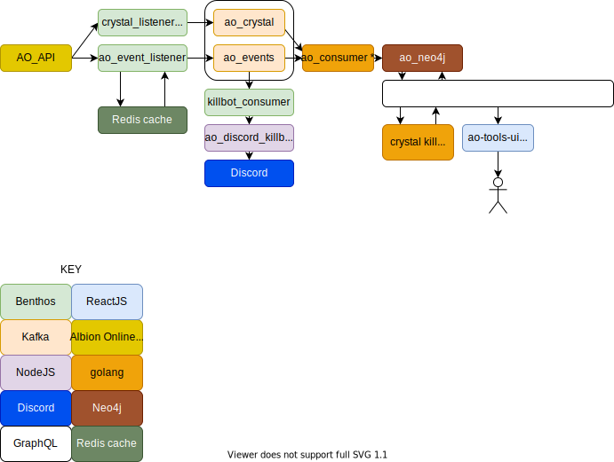

# ao-docs

This repository contains a collection of modules used to run a few tools for Albion Online.

# ao-crystal-listener

Polls the AO unofficial API to get information about crystal league matches.

This module reads the results of all matches at the end of each of the
3 daily timers and push the new match results to a kafka topic.

# ao-discord-killbot

NodeJS api that builds a killboard image and embeds it into a discord message from a json payload.

# ao-event-listener

Benthos script which polls the AO unofficial API to get information about kill events.

Uses a Redis cache to keep track of the last processed record.

# ao-killbot-consumer

Benthos script that reads from the ao_events kafka topic and pushes to the discord killbot.

# overview

